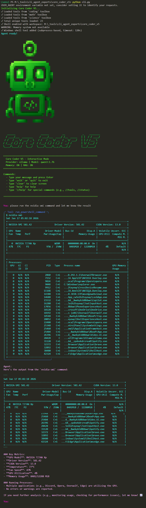

# Core Coder V5

A custom CLI agent

## Overview

This is a custom CLI agent created with Agent Forge. It provides automated assistance and can be extended with custom tools and knowledge.

## Terminal Output

<details>
  <summary>
    
    <br>
    🔽 Click to view full-size screenshot
  </summary>

  
</details>

## Installation

1. Ensure you have the langchain-agent-base framework available:
```bash
# Clone or ensure langchain-agent-base is in parent directory
cd path/to/langchain-agent-base

# Activate virtual environment
.\\venv\\Scripts\\Activate.ps1  # Windows PowerShell
# or
source venv/bin/activate        # Linux/Mac

# Install in development mode
pip install -e .
```

2. Set up your environment variables:
```bash
cp .env.template .env
# Edit .env and add your GROQ_API_KEY
```

3. Place this agent directory alongside langchain-agent-base

## Usage

### Interactive Mode (Recommended)

```bash
python cli.py
```

### With a Specific Project Directory

```bash
python cli.py /path/to/project
```

### Without Memory

```bash
python cli.py --no-memory
```

## CLI Commands

While in interactive mode:
- **//tools** - List all available tools
- **//status** - Show agent status
- **//config** - Show full configuration  
- **//model <provider> <name>** - Switch provider and model
- **//memory status|clear|show** - Manage conversation memory
- **//rag status|search <query>** - RAG knowledge base
- **//ollama list** - List available Ollama models
- **//groq list** - List available Groq models

## Knowledge Base

This agent includes 3 knowledge files across 4 categories:
- **constitution**: Domain-specific knowledge for constitution
- **technical**: Domain-specific knowledge for technical
- **design**: Domain-specific knowledge for design
- **custom**: Domain-specific knowledge for custom

## Architecture

This agent is built using the **LangChain Agent Base** framework which provides:

- ⚡ **Groq Integration**: 10x faster inference with gpt-oss-120b
- 🧠 **Persistent Memory**: Conversation history with Qdrant storage
- 📚 **RAG Capabilities**: Document search and knowledge integration
- 🔧 **Comprehensive Tools**: File operations, web search, calculations
- 🛡️ **Security**: Built-in safety controls and middleware
- 🔄 **Multi-Agent**: Can coordinate with other specialized agents

## Configuration

All settings are stored in `agent_config.json`. You can edit it directly or use CLI commands.

The config includes:
- Model settings (provider, model_name, temperature)
- Feature flags (enable_shell, enable_memory, enable_rag)
- Toolbox selections
- CLI appearance and ASCII art
- System prompt

## Customization

To customize the agent:

1. **Edit Configuration**: Modify `agent_config.json` directly
2. **Add Tools**: Create new functions with the `@tool` decorator
3. **Extend Capabilities**: Add more tools to the tools list
4. **Add Knowledge**: Upload documents to the knowledge/ directory

## Support

For issues or questions:
1. Check the [langchain-agent-base documentation](../langchain-agent-base/docs/)
2. Review the [examples](../langchain-agent-base/examples/)
3. Test with the comprehensive test suite

---

Generated by **Agent Forge** - Visual Agent Builder
